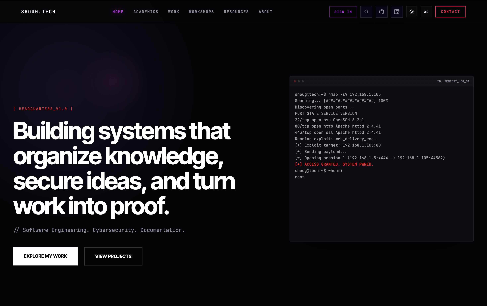
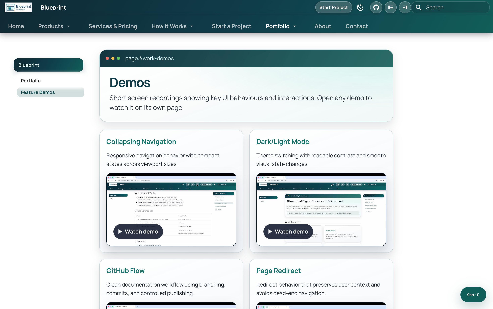
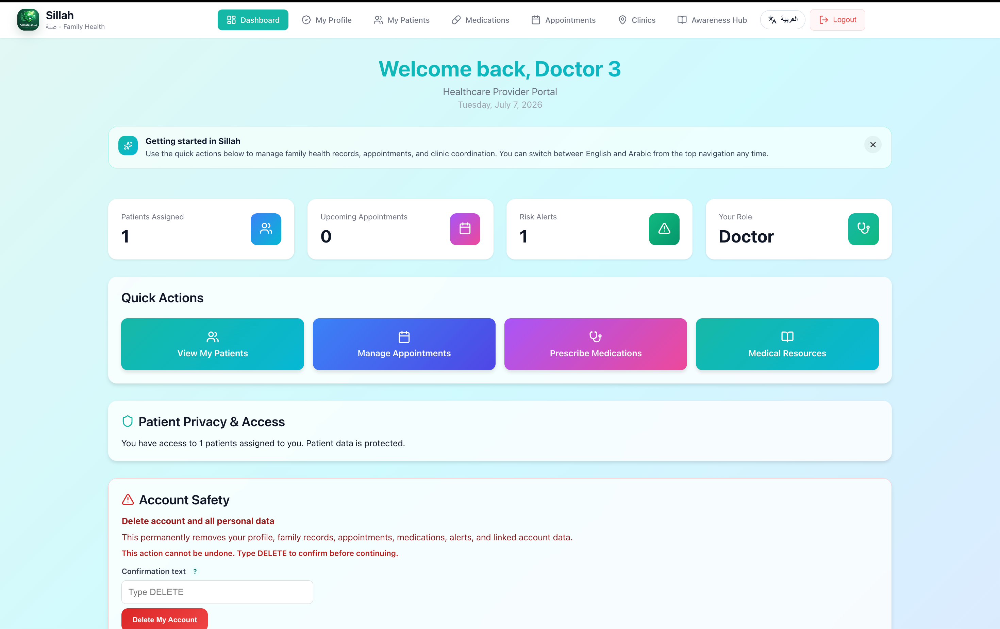
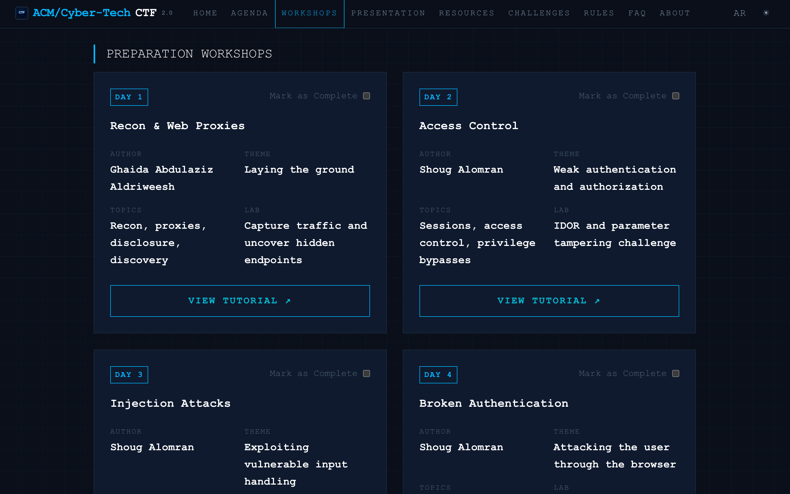

# S. Alomran

<section class="identity-hero" id="top">
  

    Software Eng Student
    Cybersecurity Trainee
    Founder, Blueprint Studio
  

  <h1 class="hero-title">Building systems from idea to deployment.</h1>
  

    Software Engineering &amp; Cybersecurity student at Prince Sultan University. I design and build production-quality platforms with thoughtful architecture, modern interfaces, and an uncompromising focus on documentation and security.
  

  

    <a href="#projects" class="gradient-button">View Systems &amp; Architecture</a>
  

</section>

<section class="identity-section" id="projects">
  <h2 class="section-title">Deployed Systems</h2>
  

    <a class="project-card project-card--featured project-card--wide" href="https://shoug-tech.com/" target="_blank" rel="noreferrer">
      

        Live
        
      

      <h3>SHOUG.TECH Platform &#8599;</h3>
      
A comprehensive personal technical platform functioning as a digital garden. It documents full-stack projects, cybersecurity workshops, academic research, and curated technical resources in a highly performant, searchable interface.

      

        ReactMkDocsCloudflareStatic Generation
      

    </a>
    <a class="project-card" href="https://blueprint.shoug-tech.com/" target="_blank" rel="noreferrer">
      

        
      

      <h3>Blueprint Studio &#8599;</h3>
      
Digital studio designing and engineering professional web presences. Focused on delivering premium, accessible, and fast digital experiences for clients.

      

        Modern WebUI/UXJavaScript
      

    </a>
    <a class="project-card" href="https://sillah-app.shoug-tech.com/" target="_blank" rel="noreferrer">
      

        
      

      <h3>Sillah Health Management System &#8599;</h3>
      
Family health management platform focused on healthcare workflows. React interface connected to Supabase-backed data flows, authentication logic, and responsive operational screens.

      

        ReactSupabaseSQLAuthentication
      

    </a>
    <a class="project-card project-card--wide" href="https://psu-ctf.shoug-tech.com/" target="_blank" rel="noreferrer">
      

        
      

      <h3>ACM CTF Platform &#8599;</h3>
      
Cybersecurity competition and event platform designed for technical engagement. Balances cybersecurity branding, participant clarity, and responsive structure.

      

        ReactCybersecurity UIGitHub Pages
      

    </a>
  

</section>

<section class="identity-section" id="capabilities">
  <h2 class="section-title">Technical Domains</h2>
  

    <article>
      <h3>Frontend Architecture</h3>
      
React, JavaScript (ES6+), HTML5, CSS3, Modern Web Development.

    </article>
    <article>
      <h3>Backend &amp; Data</h3>
      
Supabase, SQL, Relational Database Design, REST APIs.

    </article>
    <article>
      <h3>Infrastructure &amp; Tooling</h3>
      
Git, GitHub, Cloudflare, MkDocs, Static Site Generation.

    </article>
    <article>
      <h3>Engineering Practice</h3>
      
Requirements Engineering, UML Documentation, Clean Architecture.

    </article>
  

</section>

<section class="identity-section" id="leadership">
  <h2 class="section-title">Leadership &amp; Execution</h2>
  

    <article class="leadership-item">
      

        <h3>Course Instructor &amp; Peer Tutor</h3>
        
Academic Leadership

      

      
Develop and maintain interactive learning platforms for students. Created comprehensive course websites featuring structured summaries, practice exams, and technical documentation to streamline the learning process for complex engineering concepts.

    </article>
    <article class="leadership-item">
      

        <h3>ACM Student Chapter VP</h3>
        
Prince Sultan University

      

      
Co-leading chapter initiatives, organizing technical workshops, and fostering a community of engineering excellence among peers.

    </article>
    <article class="leadership-item">
      

        <h3>Project Evolution</h3>
        
Engineering Philosophy

      

      
Consistent track record of transforming standard university assignments into fully public, deployed systems. I prioritize better interfaces, rigorous documentation, and enhanced functionality beyond baseline requirements to build real-world products.

    </article>
  

</section>

<section class="identity-section" id="philosophy">
  

    <article class="philosophy-card philosophy-card--cyan">
      <h3>Security Focus</h3>
      
Deeply invested in understanding attacker methodology to build resilient systems. Focus areas include penetration testing, vulnerability assessment, ethical hacking, and responsible disclosure. Security is treated as foundational architecture, not a patch.

    </article>
    <article class="philosophy-card philosophy-card--green">
      <h3>Engineering Philosophy</h3>
      
Code must be maintainable. Solutions should be practical over unnecessarily complex. I believe documentation is integral to engineering, not an afterthought. A system is only as good as a new developer's ability to understand and safely modify it.

    </article>
  

</section>

<section class="identity-section contact-section" id="contact">
  

    <h2>Initialize Connection.</h2>
    
Available for discussions on software architecture, security, and digital experiences.

    

      <a href="cv/?download=1" class="gradient-button">Download Resume</a>
    

    

      <a href="https://shoug-tech.com" target="_blank" rel="noreferrer">SHOUG.TECH</a>
      <a href="https://github.com/Shoug-Alomran" target="_blank" rel="noreferrer">GitHub</a>
      <a href="https://www.linkedin.com/in/shoug-alomran/" target="_blank" rel="noreferrer">LinkedIn</a>
      <a href="https://blueprint.shoug-tech.com" target="_blank" rel="noreferrer">Blueprint Studio</a>
    

  

</section>
